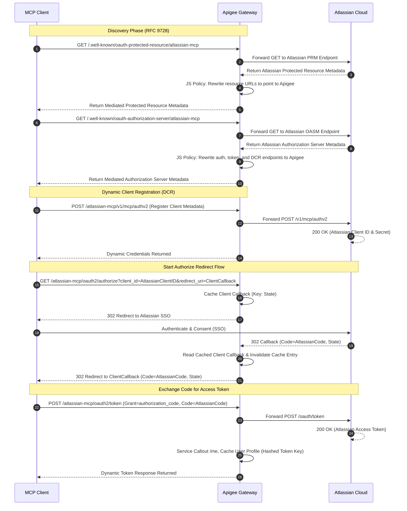
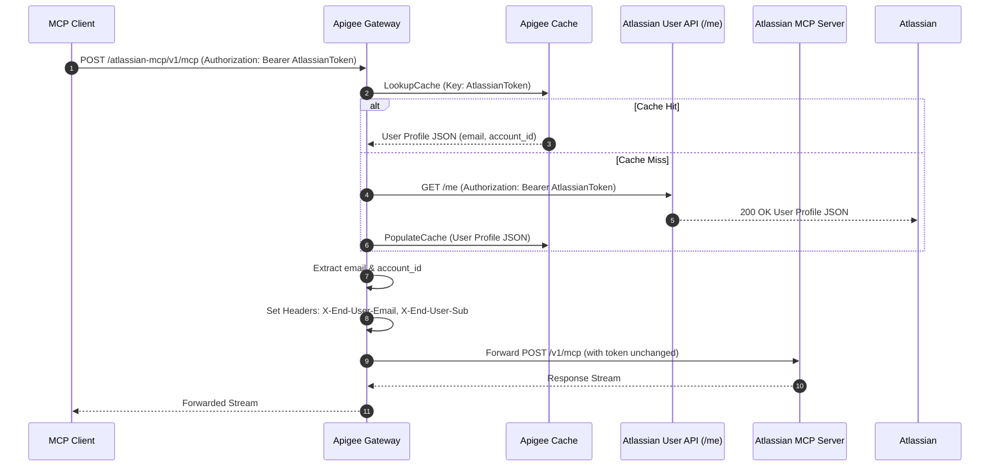
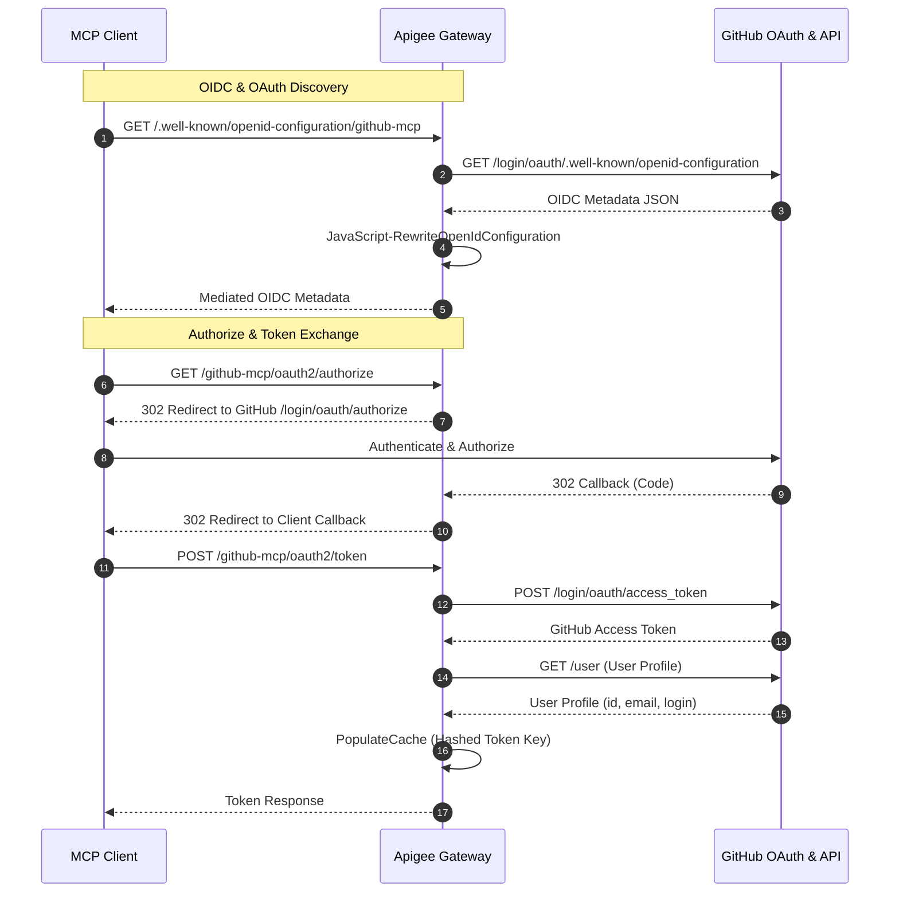
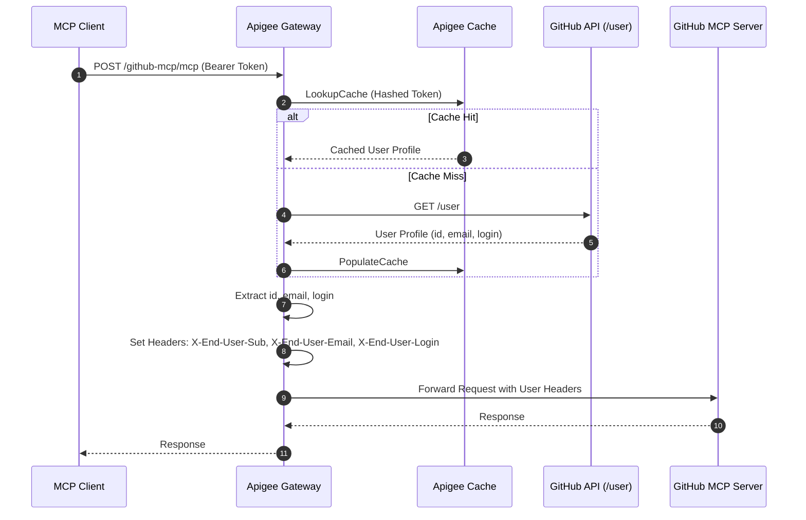

# MCP Apigee Proxies (Atlassian & GitHub)

This repository contains the configuration and codebase for placing an **Apigee API Gateway** in-between **Model Context Protocol (MCP) clients** and cloud-hosted MCP servers (**Atlassian Rovo** and **GitHub**) in a multitenant environment.

The gateways intercept MCP requests, dynamically manage client credentials and OAuth redirects under tenant-specific namespaces, validate tokens via edge-caching introspection, capture end-user identity metadata, and forward authorized requests downstream.

---

## Project Structure

* **`atlassian-mcp-proxy/apiproxy/`**: The dedicated Atlassian MCP proxy bundle (`atlassian-mcp`), exposing dynamic client registration passthroughs and introspective resource access.
* **`github-mcp-proxy/apiproxy/`**: The dedicated GitHub MCP proxy bundle (`github-mcp`), exposing OAuth discovery metadata, OIDC configuration, authorization redirects, token exchange, and authenticated tool calls with user identity injection.

---

## Atlassian MCP Proxy Architecture & Authorization Flow

The authentication flow utilizes **RFC 9728** (Protected Resource Metadata) for discovery, dynamically registers client credentials, intercepts OAuth 3LO redirects to capture codes, and proxies token exchanges back to Atlassian while caching sessions at the edge.

### Flow 1: RFC 9728 Discovery, Dynamic Registration & Token Acquisition (SSO)


### Flow 2: Proxy Request Flow (Introspection & Caching)


---

## GitHub MCP Proxy Architecture & Flow

The GitHub MCP proxy provides secure mediation between local MCP tools and GitHub, handling OIDC/OAuth discovery, token exchange, and user identity extraction (`X-End-User-Email`, `X-End-User-Sub`, `X-End-User-Login`).

### Flow 1: OIDC Discovery & OAuth Token Exchange


### Flow 2: Authenticated Tool Calls & Metadata Injection


---

## Client Integration Guide

To configure your local developer harnesses to query Atlassian or GitHub through the Apigee Gateway:

### 1. **Cursor IDE**
1. Create or edit `mcp.json` (`.cursor/mcp.json` or `~/.cursor/mcp.json`):
   ```json
   {
     "mcpServers": {
       "atlassian-apigee": {
         "url": "https://YOUR_APIGEE_HOST/atlassian-mcp/v1/mcp"
       },
       "github-apigee": {
         "url": "https://YOUR_APIGEE_HOST/github-mcp/mcp/"
       }
     }
   }
   ```
2. Save the file and complete the browser authentication prompt.

### 2. **Claude Code (CLI)**
1. Run:
   ```bash
   claude mcp add --transport http atlassian-apigee https://YOUR_APIGEE_HOST/atlassian-mcp/v1/mcp
   claude mcp add --transport http github-apigee https://YOUR_APIGEE_HOST/github-mcp/mcp/
   ```
2. Run `claude mcp login atlassian-apigee` / `github-apigee` and complete browser authentication.

---

## Deployment

Deployments are performed using **`apigeecli`**.

### Deploy Atlassian MCP Proxy
```bash
apigeecli apis create bundle -n atlassian-mcp -f ./atlassian-mcp-proxy/apiproxy -o <YOUR_ORG> -e <YOUR_ENV> --default-token --ovr --wait
```

### Deploy GitHub MCP Proxy
```bash
apigeecli apis create bundle -n github-mcp -f ./github-mcp-proxy/apiproxy -o <YOUR_ORG> -e <YOUR_ENV> --default-token --ovr --wait
```
