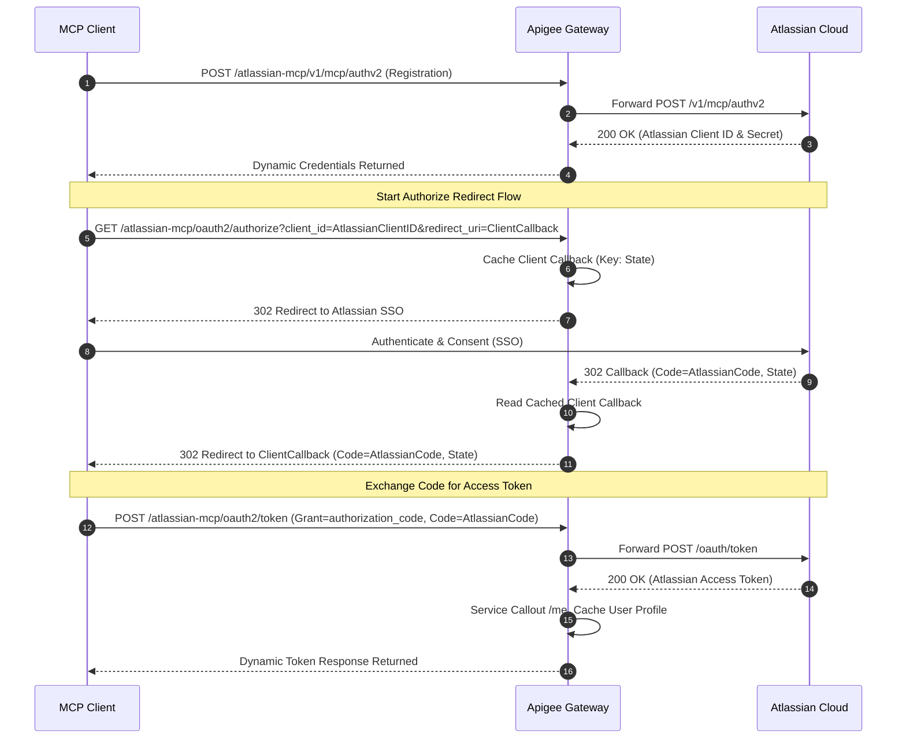
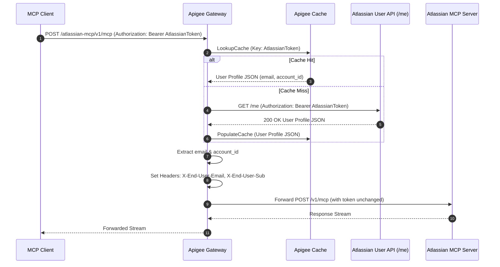

# Atlassian MCP Apigee Proxy

This repository contains the configuration and codebase for placing an **Apigee API Gateway** in-between **Model Context Protocol (MCP) clients** and the cloud-hosted **Atlassian Rovo MCP Server** (`https://mcp.atlassian.com`) in a multitenant environment.

The gateway intercepts MCP requests, dynamically manages client credentials and OAuth redirects under the tenant-specific namespace, validates Atlassian-issued tokens via edge-caching introspection, captures end-user identity metadata, and forwards authorized requests downstream.

---

## Project Structure

* **`atlassian-mcp-proxy/apiproxy/`**: The dedicated Atlassian MCP proxy bundle (`atlassian-mcp`), exposing dynamic client registration passthroughs and introspective resource access.

---

## Architecture & Authorization Flow

The authentication flow utilizes **RFC 9728** (Protected Resource Metadata) for discovery, dynamically registers client credentials, intercepts OAuth 3LO redirects to capture codes, and proxies token exchanges back to Atlassian while caching the sessions at the edge.

### Flow 1: Client Registration & Token Acquisition (SSO)


### Flow 2: Proxy Request Flow (Introspection & Caching)


---

## Why Apigee?

This API proxy acts as a smart mediator between your local MCP tools and Atlassian. By deploying this gateway, you get:

* **Zero-Configuration Client Onboarding**: You don't need to configure redirect URIs for every single developer's IDE or local harness. Apigee acts as a single secure callback endpoint and routes authorization flows back to local client apps automatically.
* **Super-Fast Response Times**: User profiles are validated and cached at the network edge for 10 minutes. This eliminates redundant introspection calls to Atlassian APIs, making your developer tools feel snappy.
* **Production-Grade Security**:
  * **Hashed Keys**: Plaintext Atlassian access tokens are never used as keys or stored raw in memory—they are cryptographically hashed (SHA-256) natively on the gateway.
  * **One-Time Redirect Cleanups**: State callback URLs are deleted instantly after use to prevent session-replay attacks.
  * **Edge CORS Mediation**: Browser preflight OPTIONS requests are handled locally at the gateway, avoiding downstream Atlassian rejection of DELETE/PUT methods.
* **Traceable Auditing**: Apigee automatically links Atlassian tokens to actual developer identities (`X-End-User-Email` and `X-End-User-Sub` headers) so you have full visibility into which developer is querying which corporate documents.
* **Payload Crash Protection**: Sanitizes downstream encoding headers (such as removing unsupported Brotli encoding) to prevent gateway XML parser faults.


---

## Client Integration Guide

To configure your local developer harnesses to query Jira and Confluence through the Apigee Gateway, follow the setup instructions below.

### 1. **Cursor IDE**
Cursor supports Dynamic Client Registration (DCR) for remote MCP servers.
1. Create or edit the `mcp.json` configuration file:
   * **Project Scope**: `.cursor/mcp.json` (inside your project directory root)
   * **Global Scope**: `~/.cursor/mcp.json`
2. Add your server configuration pointing to the gateway endpoint:
   ```json
   {
     "mcpServers": {
       "atlassian-apigee": {
         "url": "https://YOUR_APIGEE_HOST/atlassian-mcp/v1/mcp"
       }
     }
   }
   ```
3. Save the file. Cursor will automatically reload the configuration, detect that authentication is required, and prompt you to complete the Atlassian OAuth login flow in your browser.

### 2. **Claude Code (CLI)**
Claude Code natively supports dynamic OAuth discovery and login for remote HTTP servers.
1. In your terminal, run the following command to add the server:
   ```bash
   claude mcp add --transport http atlassian-apigee https://workshop.iloveapi.management/atlassian-mcp/v1/mcp
   ```
2. Claude Code will initialize the connection, detect the authentication challenge from the gateway, and prompt you to run:
   ```bash
   claude mcp login atlassian-apigee
   ```
3. Follow the instructions to log in through your browser and authorize the client.


### 3. **VS Code / GitHub Copilot**
For VS Code extensions (like GitHub Copilot Chat or other MCP client plugins) that support remote servers:
1. Configure the server endpoint to: `https://workshop.iloveapi.management/atlassian-mcp/v1/mcp` (or `/v1/sse` depending on the extension's transport preference).
2. The extension will automatically register, detect that authentication is required, and prompt you to authorize through your browser.


---

## Enhancements & Add-Ons

To further extend and scale your Atlassian MCP Gateway, consider implementing the following production-grade add-ons:

### 1. Guarding Against Tool Poisoning with **Model Armor**
Because MCP tools receive prompts and parameters generated directly by LLMs, they are vulnerable to **prompt injection** and **indirect tool poisoning** (e.g. an LLM reads a poisoned Confluence page and generates a malicious command parameters payload back to the gateway).
* **Mitigation**: Deploy Google Cloud **Model Armor** policies on Apigee to scan incoming LLM requests and responses. This filters out prompt injections, personally identifiable information (PII) leakage, and content policy violations before payloads reach the target system.
* For setup details, see the [Apigee Model Armor Tutorial](https://docs.cloud.google.com/apigee/docs/api-platform/tutorials/using-model-armor-policies).

### 2. Monitoring, Logging, and Tracing Streamable HTTP Connections
Since MCP utilizes persistent streamable HTTP connections (which rely on SSE under the hood for event pushing):
* **Streaming Logging**: Ensure your gateway logging policies (like MessageLogging or syslog integration) do not block or buffer streaming payloads. For streaming data patterns, refer to the [Apigee Server-Sent Events Guide](https://docs.cloud.google.com/apigee/docs/api-platform/develop/server-sent-events).
* **Distributed Tracing**: Attach Google Cloud Trace to your API proxy to measure latencies across the dynamic callback routes and introspections, identifying downstream bottleneck paths.
* **API Monitoring**: Set up customized alerting dashboards in Apigee API Monitoring to track response error rates (e.g. 401s, 403s) and token cache-hit ratios.

---

## Deployment

Deployments are performed using **`apigeecli`**. Please refer to the official [apigeecli repository](https://github.com/apigee/apigeecli) for installation instructions.

Deploy the Atlassian MCP API proxy bundle to your Apigee Organization using the `apiproxy` directory:

```bash
apigeecli apis create bundle -n atlassian-mcp -f ./atlassian-mcp-proxy/apiproxy -o <YOUR_ORG> -e <YOUR_ENV> --default-token --ovr --wait
```
